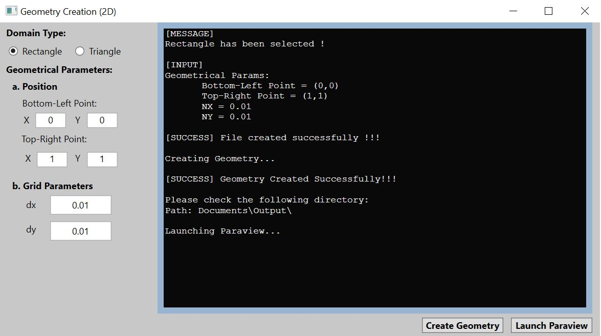
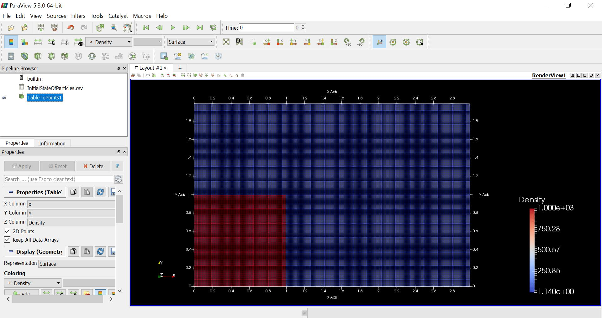

### About Me:
A Senior SW Er., expertise in C++ development, having almost 6 years of prooduct development experience in Defense, Aerospace and Automotive domains.

### Profile Highlights:
SW Er, M.Tech from IIT, University Rank holder, 

### Technical Expertise:
C++, Git, Bitbucket, Jira, G-Test, Batch/Shell/python Scripting, vector CANape

### Current Position:
Senior Software Engineer at Bosch working for ADAS/AD Systems (CAN Signal processing).

### Previous work experience:
Dassault Systemes, Wipro, IC&SR (IIT Madras)

### Portfolio:
Demonstration of numerical Fluid simulation through a Classical Dam-break problem.

### Step 1 (Input): Specifying dimension for creating 2D-Geometry [[WPF Application](https://github.com/Yogesh17IITM/WPF-Application)]

  
 

### Step 2 (Process): Creating Geometry based on given Input [[Creating Geometry](https://github.com/Yogesh17IITM/CreatingInterfaceGitHub)]

  
 

### Step 3 (Output): Simulate using SPH solver and visualize results [[Fluid Simulation](https://github.com/Yogesh17IITM/Smoothed-Particle-Hydrodynamics)]

  
 

  
### Contact
  
| **Linkedin** | **Gmail** | **Website** | **Hackerrank** |
|:-:|:-:|:-:|:-:|
| 
 
  |  
 
  | 
 
  | 
 
 |
  

### For More Topics:
[Go to My Repositories](https://github.com/Yogesh17IITM?tab=repositories)
