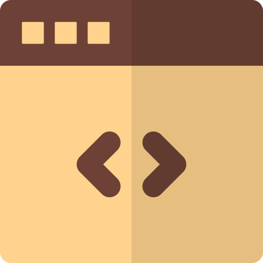

# Yogeshwaran R
_Results oriented, well organized, meticulous employee with 7 years of experience in C++._ _A self-motivated and an enthusiatic team player with experience from Automotive Domain. Passionate to contribute towards 'self-Driving' through ADAS technologies and 'safe-driving' through Driver Monitoring Systems._

### Current Position and Previous Experiences:
Senior SW Engineer at Harman International. Worked at Bosch (BGSW), Dassault Systemes, Wipro and IC&SR (IIT Madras).

### Technical Skills:
C++, Python, Linux, OpenCV (Computer Vision), Shell Scripting

### Domain knowledge:
Mobility (ADAS and Intelligent Cockpit), PLM (CATIA, CAA)

### Project Portfolio:
Simulation of water sloshing in a tank (self-driven project, developed using C++, CFD technique).

  
 

### Contact:

| **Linkedin** | **Gmail** | **Website** | **Hackerrank** |
|:-:|:-:|:-:|:-:|
| 
 
  |  
 
  | 
 
  | 
 
 |  

### For More Topics:
[Go to My Repositories](https://github.com/Yogesh17IITM?tab=repositories)

### Profile Stats

